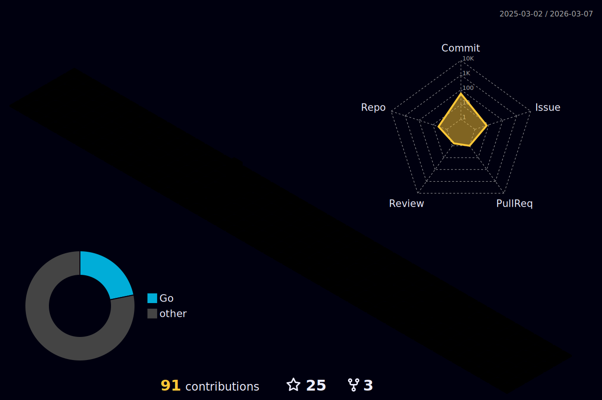

# Edward zZhang

```markdown
👨🏻‍💻 Hello！I'm Edward Zhang, a 🇨🇳 web developer.

```

<br>


## I'm passionate about:

- `🍎`  **Apple ecosystem**
- `💻`  **Web development**
- `📱`  **Mobile & Watch apps**
- `🎤`  **Sound effect & Music**
- `📷` **Photography**
- `🏎` **Driving**
<br>

## Skills


<br>

## More Details(Click For More)

<details>
	<summary>Develop Skills</summary>
	<ul>
		<li><b>Go</b>: Gin,Hertz. </li>
		<li><b>PHP</b>: ThinkPHP,Laravel. </li>
		<li><b>DB</b>: MySQL,PostgreSQL,MongoDB. </li>
  	</ul>
</details>

<details>
	<summary>Develop Utilities</summary>
	<ul>
	       <li>IntelliJ IDEA.</li>
	       <li>Visual Studio Code.</li>
	       <li>iterm2.</li>
	       <li>Postman.</li>
	       <li>Git.</li>
	</ul>
</details>

<details>
	<summary>Other</summary>
	<ul>
		<li><b>Systems</b>: Windows, MacOS.</li>
		<li><b>VM</b>: Docker,Parallels Desktop.</li>
		<li><b>Web Servers</b>: Nginx.</li>
	</ul>
</details>
<br>
