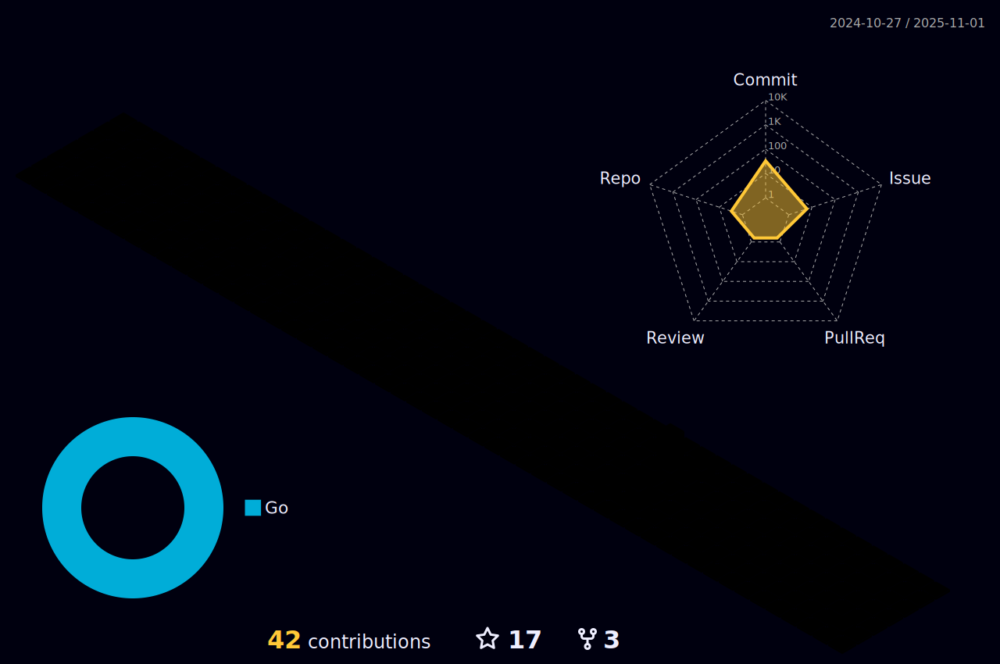

# Edward zZhang

 Hi there ! I'm a web developer 👨🏻‍💻.
===========================================================================================================================
## My GitHub Stats

<a href="http://www.github.com/FlameMida">

	

 
</a>

## Skills

 

## More Details(Click For More)

	
Develop Skills

	<ul>
		<li><b>Go</b>: Gin,Hertz. </li>
		<li><b>PHP</b>: ThinkPHP,Laravel. </li>
		<li><b>DB</b>: MySQL,PostgreSQL. </li>
  	</ul>

	
Develop Utilities

	<ul>
		<li><b>OS</b>: MacOS.</li>
		<li><b>Web Servers</b>: Nginx.</li>
		<li><b>IDE</b>: IntelliJ IDEA/Visual Studio Code.</li>
		<li><b>Terminal</b>: iterm2.</li>
		<li><b>VCS</b>: Git.</li>
	</ul>

 
